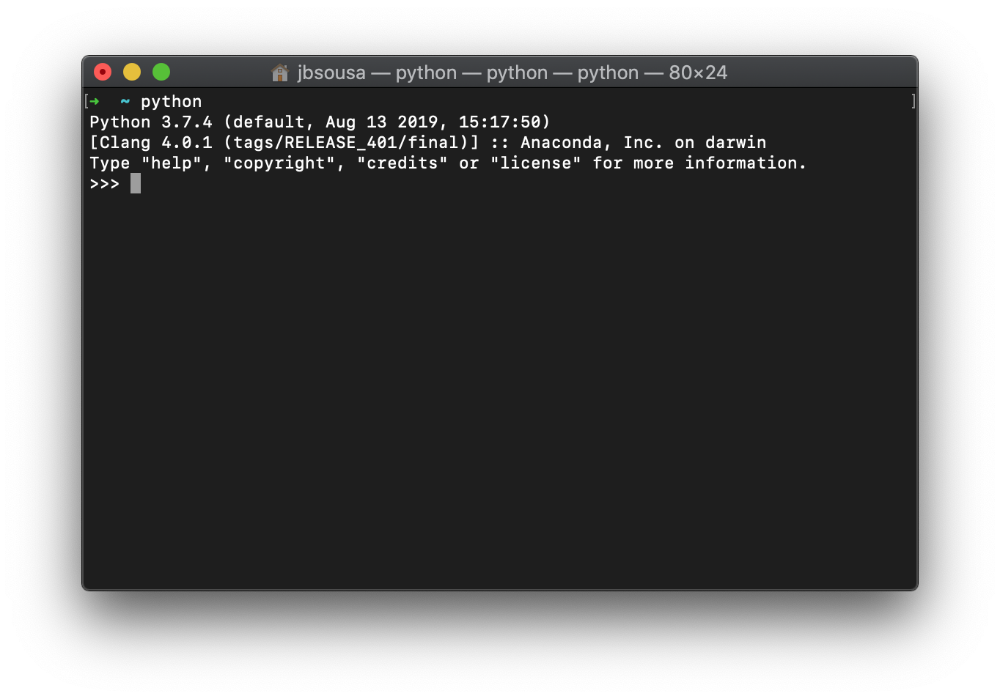
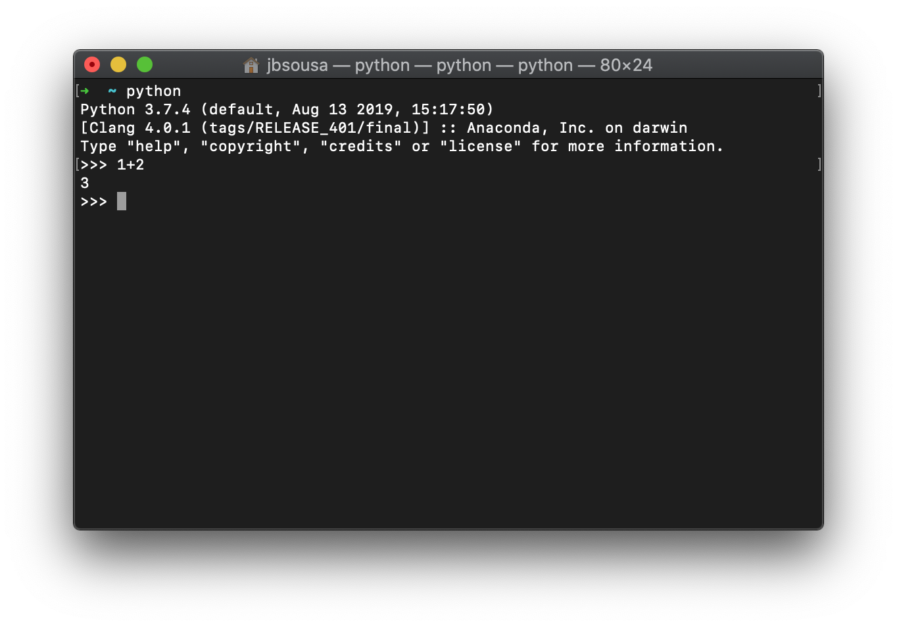
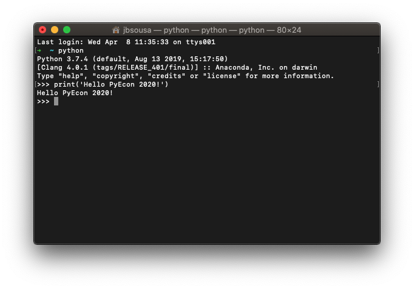

# Introduction to Python, Spring 2020

### MSc in Economics, Universidade Católica Portuguesa

João Brogueira de Sousa [jbsousa@ucp.pt]

## What is Python?

"*Python is an interpreted, high-level, general-purpose programming language.*" ([Wikipedia](https://en.wikipedia.org/wiki/Python_(programming_language)))

- "interpreted": executes without previously compiling a program
- "high-level": abstracts from details of the computer (memory managment)
- "general-purpose": wide variety of applications

### What for and why is it widely used?

- Easy to learn and use, in comparison to other programming languages.
- Provides many useful tools to work with data.
- Popular and open source programming language: means you don't have to write everything from scratch for your application, but can often use (and contribute to) open source code. 
- General purpose: data analysis, data visualization, financial modeling, websites, presentations, etc.

## How can we access it?

https://www.python.org/

We can install Python like any other piece of software, by [downloading](https://www.python.org/downloads/) and installing the relevant software packages. 


However, for this course we need additional Python resources (i.e. packages, *libraries* of code with Python *functions* we will use often), which are not included in the core Python distribution.

Instead of installing each of these packages individually, we will install the [Anaconda Python distribution](https://www.anaconda.com/distribution/).

By installing [Anaconda](https://en.wikipedia.org/wiki/Anaconda_(Python_distribution)), we make sure not only that we have all the Python packages we need, but that they interact smoothly when we use them together.

## How can we use it?

Once Python is installed, we can use directly by openning a Terminal window (*Command prompt* in Windows), and typing `python`:



We have started the Python *interpreter*, meaning that we can now type in statements that our computer will be able to interpret in Python, provided they are written in correct Python language.

Exit by typing `control+D` on Unix or `control+Z` on Windows, or `quit()`.

With the Python interpreter, we can perform simple operations:



Or we can use Python functions available in the core Python libraries (we can also create our own functions!):



### Jupyter Notebooks

Instead of using Python directly from the Command/Terminal window, we will use a software called [Jupyter](https://jupyter.org/). 

[Jupyter](https://jupyter.org/) is an interactive development environment. Using [Jupyter Notebooks](https://mybinder.org/v2/gh/ipython/ipython-in-depth/7e5ce96cc9251083979efdfc393425f1229a4a68), we can create documents (the Notebooks) that contain Python code, graphics, text, all in the same file.

We can easily share Jupyter Notebooks, and we can convert them to PDF, interactive slides, website pages, and more. You have actually been reading these lines after I wrote them using a Jupyter Notebook! (more on this later...)


```python
print("Welcome to your first Jupyter Notebook!")
```

    Welcome to your first Jupyter Notebook!


## Exercises

Download and install the Anaconda distribution on your laptop. 

Choose [Anaconda 2020.02 with Python 3.7 version](https://www.anaconda.com/distribution/).

### 1. Your first Python program

After installing, open the Anaconda Prompt (terminal on Linux or macOS).

Type `python`. The `>>>` means you are now able to run Python code.

Type `print("Hello Python world!")` and press Enter.

Exit Python: on Windows, press `crtl+z` and Enter. On Linux or macOS, type `exit()` and press Enter.

### 2. Run Python in a Jupyter Notebook

At the Anaconda Prompt (terminal on Linux or macOS), type `jupyter-notebook` and press Enter.

Create a new Python 3 Notebook. 

Type `print("Hello Python world!")` in the empty cell, and evaluate it by pressing `Shift+Enter`.

Close the Notebook and in the Notebook server directory, select and shutdown the Notebook (it should be named Untitled.ipynb in case you have not changed the name), and delete it. 

At the Anaconda Prompt, press `crtl+z` (Windows) or `crtl+c` to exit Jupyter.

For detailed instructions see the [Anaconda User guide](https://docs.anaconda.com/anaconda/user-guide/getting-started/) and [Jupyter's Quick Start guide](https://jupyter-notebook-beginner-guide.readthedocs.io/en/latest/execute.html).
